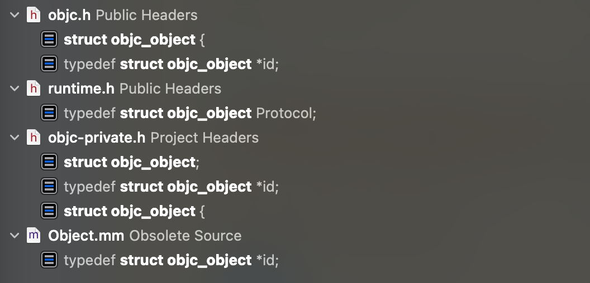
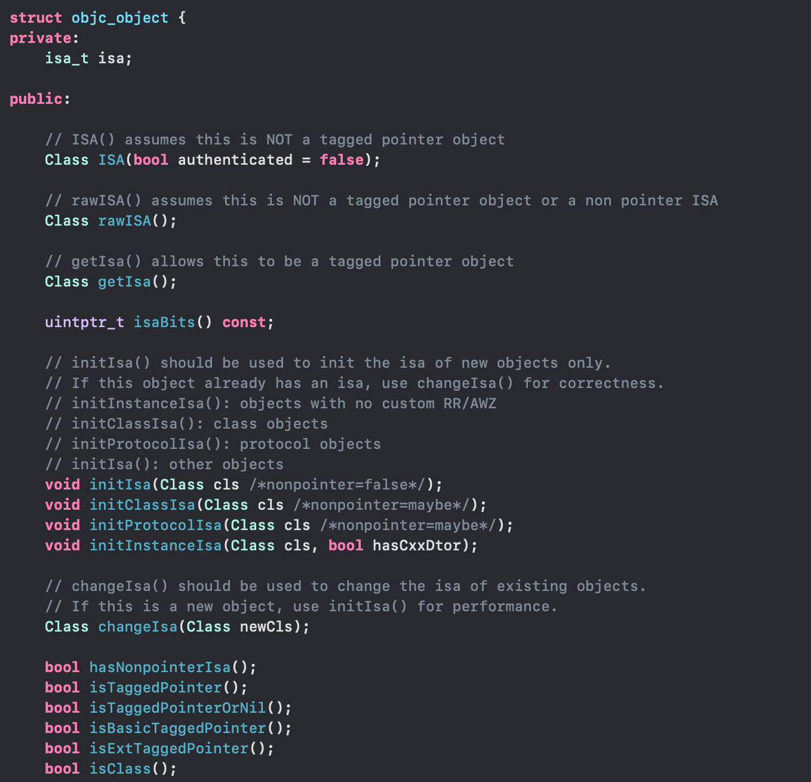
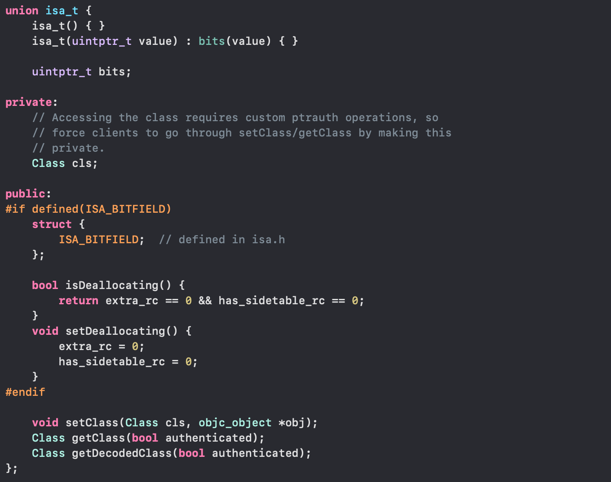

# 引言
上一篇博客我们引出了类的本质是 struct 结构体，并且所有的类都是`objc_object`这个结构体，所以这个结构体至关重要，我们继续探究其组成结构能够让我们对 OC 这门语言有一个更深入的了解，以后说出去才能对得起`精通`两个字。
好的，废话不多说，让我们开搞!
# 源码分析
## 源码下载
OC 这个语言的实现自然是开源的，我们可以从 [Apple Developer](https://opensource.apple.com/tarballs/objc4/) 官网下载。
下载后的源码是不能直接编译运行的，需要进行一些配置之后才可以运行，具体的运行方式可以查看[这篇博客](https://juejin.cn/post/6914265121183236104)进行学习配置，这边就不再进行赘述了。本文基于`objc4-818.2`进行分析
## 源码定位
首先，我们全局搜索 `struct objc_object`来查找定义，得到以下搜索结果

其中`Public Headers`我们就不去看了，都是对外开放的头文件定义，一般不涉及干货，关键的内容一般都包含，我们直接看`objc-private.h`的内容，一看就是很重要的东西。
点击查阅，我们就可以看到`objc_object`的完整定义了。
这边我截取几个比较重要的片段，来一起分析。剩余的片段重要性稍次，可以自行探索，有些后续文章也会讲到。
**objc_object 定义**

**isa_t 定义**

看到这个定义是不是有一种，似乎`objc_object`似乎并不复杂的感觉!
首先抛开繁杂的方法定义，我们就看`objc_object`本身的成员变量只有一个，那就是大名鼎鼎的`isa`。其名气之盛不用多说，觉得是面试必面，iOS 底层学习的开端，可以有效区分一个 iOS 工程师是否对底层有了解，并且细问 `isa`的细节，就显著区分其是真正了解还是道听途说。
收回来，我们来看`objc_object`的具体组成有以下几个部分
**成员变量**
```C
isa_t isa;
```
**初始化相关方法**
```C
    // initIsa() should be used to init the isa of new objects only.
    // If this object already has an isa, use changeIsa() for correctness.
    // initInstanceIsa(): objects with no custom RR/AWZ
    // initClassIsa(): class objects
    // initProtocolIsa(): protocol objects
    // initIsa(): other objects
    void initIsa(Class cls /*nonpointer=false*/);
    void initClassIsa(Class cls /*nonpointer=maybe*/);
    void initProtocolIsa(Class cls /*nonpointer=maybe*/);
    void initInstanceIsa(Class cls, bool hasCxxDtor);

    // changeIsa() should be used to change the isa of existing objects.
    // If this is a new object, use initIsa() for performance.
    Class changeIsa(Class newCls);

    void initIsa(Class newCls, bool nonpointer, bool hasCxxDtor);
```
**其它方法**
```C
    // ISA() assumes this is NOT a tagged pointer object
    Class ISA(bool authenticated = false);

    // rawISA() assumes this is NOT a tagged pointer object or a non pointer ISA
    Class rawISA();

    // getIsa() allows this to be a tagged pointer object
    Class getIsa();
    
    uintptr_t isaBits() const;

    bool hasNonpointerIsa();
    bool isTaggedPointer();
    bool isTaggedPointerOrNil();
    bool isBasicTaggedPointer();
    bool isExtTaggedPointer();
    bool isClass();
    ………………
    ………………
    （不去一一粘贴了）
```
主要的内容，我们一一来看

## isa 分析（not nonpointer、nonpointer）


