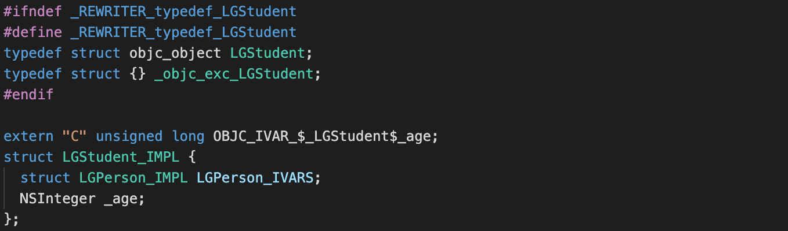

# 引言
我们每天都在使用对象，但是你知道对象底层是什么样子的吗？对象有哪些部分组成的你知道吗？对象的成员变量、属性、方法都存储在哪的你知道吗？
别急，让我们一点点去解构对象，了解对象的基本结构。

# 编译 OC
我们都知道，有个说法是ObjC 是 C 语言的超集，也就是相当于对 C 做了一层面向对象的实现的封装。那么意味着其编译出来的 C/C++ 语言的实现即为其本质的实现方式，我们对其编译的结果做分析就可以对类有一定的了解，从而打开思路，去其 ObjC源码查看其真实的实现方式。
xrun 编译：
>  xcrun 是在安装 Xcode 的时候附带安装的 Xcode 用来编译代码的命令行工具，是对 clang 的二次封装。而 clang是一个由Apple主导编写，基于LLVM的C/C++/Objective-C编译器，是 C 系列语言的编译器之王。
我们可以新建一个空的工程，写下一个类的示例，并使用 xcrun 来编译一下

编译命令：
```shell
// 模拟器 x86_64
xcrun -sdk iphonesimulator clang -arch x86_64 -rewrite-objc main.m -o main-x86_64.cpp
// 真机 arm64
xcrun -sdk iphoneos clang -arch arm64 -rewrite-objc main.m -o main-arm64.cpp 
```
我们使用 x86_64 环境下的编译结果来看下我们的类被编译成了什么样子
# 编译结果分析
我们在编译的结果内搜索我们的类，看一下存在哪些结果
## 类本体

与类相关的内容，我们找到了上图所示的编译结果，那边编译结果很有意思。宏定义判断抛开不看，我们来看一下这行代码
```C
typedef struct objc_object LGPerson;
```
这说明什么？这是不是说明`LGPerson`  其实就是`objc_object` 这个结构体的别名啊，那是不是就是说`LGPerson` 就是`objc_object` 结构体？对，就是这么神奇，它连什么继承自某某东西都不是，它就直接是`objc_object` 这个结构体!
然后!
编译之后，它额外声明了一个结构体
```C
struct LGPerson_IMPL {
	struct NSObject_IMPL NSObject_IVARS;
	NSString *_myName;
	NSString *_nickName;
};

// @property (nonatomic, strong) NSString *myName;
// @property (nonatomic, strong) NSString *nickName;
```
这个结构体`LGPerson_IMPL`才是真正的我们定义的类的内容，但是，它是以运行时的方式跟我们的类`LGPerson`进行了绑定。我们搜索`LGPerson_IMPL`可以查看到以下代码
```C
static struct _class_ro_t _OBJC_CLASS_RO_$_LGPerson __attribute__ ((used, section ("__DATA,__objc_const"))) = {
	0, __OFFSETOFIVAR__(struct LGPerson, _myName), sizeof(struct LGPerson_IMPL), 
	(unsigned int)0, 
	0, 
	"LGPerson",
	(const struct _method_list_t *)&_OBJC_$_INSTANCE_METHODS_LGPerson,
	0, 
	(const struct _ivar_list_t *)&_OBJC_$_INSTANCE_VARIABLES_LGPerson,
	0, 
	(const struct _prop_list_t *)&_OBJC_$_PROP_LIST_LGPerson,
};
```
具体细节这边就不细说了，因为相关的绑定代码也是被编译出来的，实际的底层写法不是这么写的，这个我们后面再说。我们这边以便分析，可以直接把`LGPerson_IMPL`认为是`LGPerson`的**具体实现**。
*注：在 OC 中还有一个宏定义 typedef struct objc_object \*id ，所以这也是为什么在 OC 中使用 id 声明的变量可以被赋值为任意对象而不报错。你品，你细品→ →*

我们继续看编译结果的组成，那么也就只有 3 个东西
```C
struct NSObject_IMPL NSObject_IVARS;
NSString *_myName;
NSString *_nickName;
```
后两个下一小节再说，先说第一个。那么第一个成员变量也是个结构体类型的，从名字可以推测应该是其父类相关的具体实现，那我们搜一下这个结构体有啥东西呢？搜索结果如下

看到这个，那么是不是意味着 `NSObject` 这个类是不是只有一个成员变量 isa 哇？对，没错，就是这样。
**那么我们再来拓展下**
如果是`LGPerson`的子类编译出来会是什么样子的呢？来我们动手搞一个，编译一下这样的类

`LGStudent`编译结果

是不是不由自主对自己说一句! **嗯! 这很合理!**

## 属性
我们都知道在 OC 中，`属性`就等于了`成员变量`+`set 方法`+`get 方法`(非 readonly)。百问不如一见，我们看 LGPerson 的属性的最终展现形态!
**成员变量：**
```C
NSString *_myName;
NSString *_nickName;
```
**set、get 方法：**
```C
static NSString * _I_LGPerson_myName(LGPerson * self, SEL _cmd) { return (*(NSString **)((char *)self + OBJC_IVAR_$_LGPerson$_myName)); }
static void _I_LGPerson_setMyName_(LGPerson * self, SEL _cmd, NSString *myName) { (*(NSString **)((char *)self + OBJC_IVAR_$_LGPerson$_myName)) = myName; }

static NSString * _I_LGPerson_nickName(LGPerson * self, SEL _cmd) { return (*(NSString **)((char *)self + OBJC_IVAR_$_LGPerson$_nickName)); }
static void _I_LGPerson_setNickName_(LGPerson * self, SEL _cmd, NSString *nickName) { (*(NSString **)((char *)self + OBJC_IVAR_$_LGPerson$_nickName)) = nickName; }
```
是不是很简单! 一点都不复杂哈哈!
>*注：为什么是 _I_LGPerson_nickName 而不是 nickName ，这个涉及到 selector 的编码和存储，这个我们后面的文章会讲到，有兴趣的童鞋也可以搜一搜编译结果，也会有一个直观体会*

## 对象方法与类方法
对象方法和类方法相关的内容就比较复杂，我们这边先简单看一下编译结果，有个初步的印象，之后的文章再继续深挖!
来看下这个实现

编译结果

很直观啊，非常地简单!
方法的运行时绑定的编译结果如下

>*注：同样的也涉及到 selector 的编码和存储，后续扩充*
# 总结
从上面分析结果看，OC 的类其实就是一个结构体，结构体里面存储了自己及父类的成员变量。方法是通过运行时的方式绑定上去的，当然还有其它的分类啊，协议啊等等很多东西这边就没有直接演示了，有兴趣的话还是可以自己试一下的。
重点是，经过我们的编译分析，我们就引出了`objc_object`这个重中之重的东西，所有的运行时相关的处理啊操作啊都是这个结构体及其相关内容在处理，并且我们今天还看到了`isa`这个在面试中频繁刷脸的存在!
那接下去! 让我们来继续分析 `objc_object` 相关内容吧!