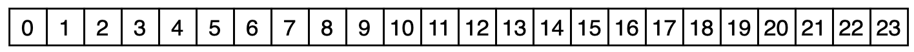

#引言
我们首先来看一个有趣的例子，思考一下他的大小

`问题`
        图中有两个结构体变量 p1,p2，其成员变量一样，仅 结构体顺序不同。那么 p1,p2 分别占用的内存大小（sizeof）是否是一样的呢？分别应该输出多少呢？是不是都是 15 个字节大小呢？
`答案`

来，是不是出现了黑人问号的画面？？
那么，从这个例子上，我们可以引申出两个问题来了：
```
1. 为什么 p1 的 size 是 16，而不是 15？
2. 为什么 p2 的 size 是 24，而既不等于 15，也不和 p1 相等等于 16？
```
不慌，我们来一一解答!
#内存对齐
OC 在对结构体及其成员变量分配内存的时候，会遵循三个内容对齐原则，用于尽可能地提高 CPU 对内存读取地速度，从而提升代码性能。
####规则一：成员变量对齐规则
```
结构体（struct）或者联合体（union）中，第一个成员（按代码编写顺序）存放在该结构体变量的首地址开始处（ offset 为 0 的地方）开始存储，并占用成员本身大小的内存空间。之后的成员按顺序，分别跟进存储，但其存储的起始位置为 offset 为其整数倍的位置。
```
什么意思呢？来上例子，上图!
以引言中的结构体`test2`为例：
```
struct test2 {
    double p1; // 8字节
    char p3;// 1字节
    int p2;// 4字节
    short p4;// 2字节
}
```
假设我们有 24 个字节（开个天眼）的内存空间用于存储 test2，那我们来看看最终它是怎么显示的
首先，是空的一排地址

然后首先进入的是`double p1`。那么按照原则，它会在 offset 为 0 的地方开始存储 8 个字节（double），存储后结果如下

然后存储下一个成员`char p3`。那么按照原则，我们首先判断接下去一个空位的 offset是否是 p3 的字节大小的整数倍。那么我没看，接下去的 offset 是 8，p3 的大小是一个字节，满足条件，成功存储，存储后结果如下

然后我们继续存储下一个成员`int p2`。按照 `char p3`的经验我们看，9 是不是 4 的整数倍呢？显然不是。依次类推判断下去，我们则会择 offset 为 12 这个位置开始存储，如下

以此类推，最终存储的结构如下

好，存完了。但是发现似乎事情不太对，明明我们只存储了 `18` 个字节`[0-17]`，那为什么最终打印出来的大小是 24 呢？那 18-23 的位置干啥去了，难道就这么空着嘛？
对，没错，就是空着。
这就引出了第二个规则`结构体大小对齐规则`
#### 规则二：结构体大小对齐规则
```
结构体变量占用的内存空间，必须是其内部成员变量中所占空间最大的成员的大小的整数倍，不足的要补齐。
```
什么意思呢，以上述例子继续举例。test2 成员占用到 了`[0-17]`的位置，那 18 是不是其内最大的`double p1`的所占空间`8`的整数倍呢？显然不是，于是补齐到 24 位，也就是`[0-23]`
至此，解释了为什么`struct test2`占用了 24 个字节而不是 15个字节，至于`struct test1`有兴趣的小伙伴可以自己动手试一试，得出的结果必然位 16 个字节。

那么规则三呢？

规则三需要另外一个例子说明，我们继续往下看
#### 规则三：结构体嵌套对齐规则
```
如果一个结构体的成员变量中有结构体类型的，形成一个嵌套关系的，则该结构体成员的存储位置要从其内最大存储空间成员变量的大小的整数倍处开始存储。同时结构体大小也按嵌套关系中最大存储空间成员大小的整数倍对齐。
```
话不多说，我们看一下一个结构体`struct test3`
```
struct test3 {
    double p1;
    int p2;
    char p3;
    short p4;
    int p5;
    test2 p6;
}
```
有兴趣的小伙伴可以自己动手试一下，这里我们直接放结论`48`。好我们看一下按照三条规则的综合版，这个的布局情况是什么样子的。
首先，我们直接快速干完非结构体成员的存储方式，如下

那么`test2 p6`从什么地方开始存呢？按照规则，`test2 p6`中最大的成员是`double`，也就是 8 个字节，则其整数倍为 24，那么也就是从 24 的位置开始，以`规则 一`开始存储，那么我们迅速撸完它

最后，最终的结构体内存大小按照其嵌套关系中最大的成员的整数倍对齐。就这个示例中，最大的为`double`，为 8 字节，那么按 8 的整数倍对齐，最终所占大小为`48`。
到此，收功。结构体的内存存储方式基本上算是讲清楚了。

# 思考
那么不知道有没有小伙伴会有这么一个疑问
```
那我们在平时写代码的过程中，是不是需要注意属性/成员变量的声明顺序呢？
```
那么，敬请期待后续文章《Objc底层探索—类的属性/成员变量重排》

